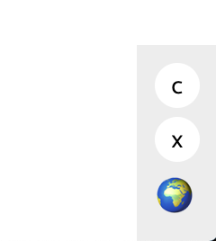
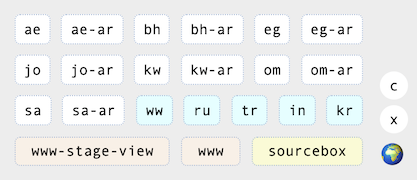

## GeoLoc

A tool for viewing the current versions on a page and switching to different geos and environments.

To build the extension:

    npm i
    npm run build

Load unpacked extension from chrome and browse to locloc/build folder.

